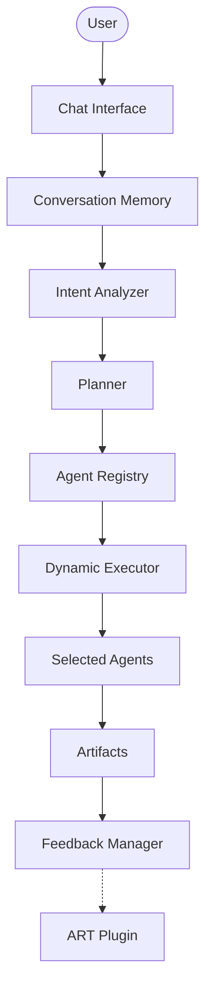

# ForgeAI

ForgeAI is a production-grade, multi-agent AI Software Engineering platform orchestrating specialized autonomous agents that collaborate to transform a software idea into production-ready artifacts. Powered by LangGraph, LangChain, and advanced LLMs, ForgeAI operates as a virtual software engineering department.

**ForgeAI v2 Evolution:** The architecture has been significantly refactored from a static, hardcoded sequence (v1) into a fully dynamic Agentic AI Platform. ForgeAI v2 introduces a plugin-based `AgentRegistry`, dynamic `LangGraph` compilation via Intent Analysis and Planning, robust Conversation Memory, and a foundation for Active Reinforcement Tuning (ART).

---

## Key Features

- **Dynamic Agent Orchestration:** Workflows are no longer statically hardcoded; they are generated on the fly.
- **Intent Analyzer:** Analyzes user prompts to classify the core engineering task automatically.
- **Planner Agent:** Synthesizes an optimized sequence of execution steps matching registered agent capabilities.
- **Agent Registry (Plugin Architecture):** Agents self-register dynamically, fulfilling the Open/Closed Principle.
- **Dynamic Workflow Execution:** Constructs and compiles a temporary LangGraph matching the planner's output.
- **Shared State Management:** `ForgeState` seamlessly shares data natively across the dynamically mapped graph via reducers.
- **Conversation Memory:** Persists user lifecycles, sessions, artifact histories, and generated plans locally.
- **Human Approval Workflow:** Checkpoints for manual user validation across critical lifecycle boundaries.
- **UML Generation Support:** Dedicated UML capabilities mapping textual requirements into visual architecture natively.
- **Syntax Validation Pipeline:** Specialized validator agents to catch malformed diagrams and trigger generation retries.
- **Feedback Collection:** Centralized `FeedbackManager` capturing detailed human feedback on generated artifacts.
- **Future ART Plugin Integration:** Architectural hook ready for Reinforcement Learning from Human Feedback (RLHF).
- **Extensible Tooling:** Easy to wrap and inject external dependencies.

---

## Architecture Overview



---

## Dynamic Execution Flow

ForgeAI natively supports iterative conversation flows through its new memory abstractions:

1. **New User**: The `ConversationMemoryManager` auto-generates a new UUID profile, sets up an isolated workspace, and provisions a new `Session`.
2. **Existing User**: Upon connection, previous context is retrieved, inflating the LLMs with historical architectural knowledge.
3. **Updated Prompt**: If a user issues follow-up directions, a new `ConversationTurn` is recorded. The Intent Analyzer intercepts it (e.g., flagging as a "Refactor" intent) and the Planner provisions a targeted workflow skipping redundant initial steps.
4. **User Feedback**: Artifact-specific feedback is passed to the `FeedbackManager`, which logs the critique and securely forwards it to the ART pipeline for future alignment.

---

## Agent Registry

ForgeAI heavily leverages modern software design patterns. The core of this is the **Agent Registry**:

- **Plugin Architecture:** You do not modify the orchestrator to add new agents.
- **Dynamic Discovery:** Each agent (e.g., `UMLGeneratorAgent(BaseAgent)`) automatically registers itself upon initialization.
- **Capability Matching:** Agents expose a `capabilities: List[str]` property. The Planner Agent reads these arrays globally to decide which agent fits the user's current intent.
- **Adding a new agent:** Simply create a subclass of `BaseAgent`, put it in `agents/new_agent/agent.py`, and export it. The Planner will instantly start utilizing it without you touching `app/dynamic_graph.py`.

---

## Workflow

The ForgeAI v2 dynamic execution lifecycle seamlessly transitions from intent to artifact:

**User Prompt** 
↓
**Intent Analysis** (Classifies structural requirement) 
↓
**Execution Planning** (Maps capabilities to required tasks)
↓
**Dynamic Agent Selection** (Fetches active models from Registry)
↓
**Execution** (Runs compiled LangGraph natively)
↓
**Artifact Generation** (Stores localized files)
↓
**Feedback Collection** (Intercepts user adjustments)

---

## UML Generation

A specialized agentic branch focuses exclusively on system visualizations.

**Input**
```json
{
  "prompt": "Build a secure payment gateway...",
  "diagram_types": [
      "sequence",
      "component",
      "class",
      "deployment",
      "activity"
  ]
}
```

**Output**
- **PlantUML**: The core structured text mapping logic.
- **Mermaid**: Secondary render formatting (where applicable).
- **Validation Report**: Rather than simply dumping text, the `UML Validator Agent` parses the generated strings against PlantUML syntactic rules. If unclosed tags or syntax violations are detected, the validator flags a failure and immediately requests a retry loop from the LangGraph orchestrator!

---

## Design Principles

- **SOLID Principles:** Strict adherence to SRP (Single Responsibility per agent/manager).
- **Plugin Architecture:** The `AgentRegistry` and `ARTPluginInterface` encapsulate external logic completely.
- **Separation of Concerns:** Data structures (`memory/models.py`), storage mechanics (`memory/storage.py`), and orchestration logic (`app/dynamic_graph.py`) are strictly decoupled.
- **Open Closed Principle:** You can scale to 100+ agents without modifying the core graph logic once.
- **Dependency Injection:** Storage engines (like `JSONMemoryStorage`) are injected into Managers, making transitioning to PostgreSQL trivial.
- **Extensibility:** The dynamic nature of the Planner allows for infinite workflow shapes.
- **Backward Compatibility:** The original static LangGraph in `app/graph.py` remains 100% operational alongside the new `dynamic_graph.py`.

---

## Performance Optimizations

- **Dynamic Agent Selection**: Skipping the entire graph overhead when the user only requests a single change.
- **Reduced unnecessary LLM calls**: Targeted execution paths lower API consumption.
- **Shared state reuse**: LangGraph reducers effortlessly merge partial outputs.
- **Conversation memory**: Cached turns prevent duplicate reasoning processing.
- **Incremental execution**: Resuming from exact failure nodes (e.g., UML syntax fixes).
- **Future parallel execution**: Designing for LangGraph's native fan-out/fan-in abilities.

---

## Future Roadmap

- **Parallel Agent Execution:** Execute QA, Security, and Code Reviewers in parallel utilizing LangGraph's native fan-out/fan-in.
- **MCP Integration:** Model Context Protocol for deep IDE tooling.
- **Multi-LLM Routing:** Send basic tasks to fast models, and complex architecture tasks to reasoning models.
- **RAG & Vector Memory:** Enhance the storage abstraction with semantic vector search.
- **Tool Registry:** Global tool availability for dynamically matched agents.
- **Distributed Agent Execution:** Queue-based agent running.
- **RLHF / ART Plugin:** Connecting the stubbed `FeedbackManager` to a localized alignment pipeline.

---

## Folder Structure

```
forge-ai-langgraph/
├── api/                   # FastAPI route endpoints
├── app/                   # Graph execution core & state definitions
│   ├── dynamic_graph.py   # NEW: Dynamic graph compiler
│   └── graph.py           # Legacy static graph
├── agents/                # Specialist agent modules
│   ├── base.py            # NEW: BaseAgent abstraction
│   ├── intent_analyzer/   # NEW: Intent parsing agent
│   ├── planner/           # NEW: Execution planner
│   ├── uml_generator/     # NEW: UML syntax generator
│   ├── uml_validator/     # NEW: UML syntax validator
│   └── [specialists]/     # Existing engineering agents
├── core/                  # Core helpers and shared libraries
│   ├── feedback/          # NEW: Feedback manager and ART plugin
│   ├── agent_registry.py  # NEW: Global plugin registry
│   ├── dynamic_executor.py# NEW: Pure sequential executor
│   └── [utils]/           # Artifact, prompt, LLM utilities
├── memory/                # Long & short-term memory layer
│   ├── manager.py         # NEW: Conversation orchestrator
│   ├── models.py          # NEW: Dataclasses for turns & sessions
│   └── storage.py         # NEW: JSON persistent backend
├── config/                # System settings config
├── artifacts/             # Outputs generated during graph execution
├── docs/                  # Project-wide developer documentation
├── tests/                 # Package test suites
├── main.py                # Launch entry point
└── requirements.txt       # Dependencies
```

---

## Technology Stack

- **Python** (3.12+)
- **LangGraph** (StateGraph, Reducers, Compilers)
- **LangChain** (LLM Wrapping, Messaging)
- **FastAPI** (API Core)
- **Rich** (CLI Output formatting)
- **PlantUML** & **Mermaid** (Architecture Rendering)
- **Pydantic** & **Dataclasses** (Validation & Schemas)
- **OpenAI**, **Gemini**, **OpenRouter** (Multi-LLM Support)

---

## Example Workflow

**Prompt:** 
*"Generate a compliance monitoring architecture with full sequence, component, and class diagrams."*

**Dynamic Execution Pipeline:**
1. The **Intent Analyzer** flags this request as `architecture_design` and `uml_generation`.
2. The **Planner Agent** queries the `AgentRegistry` and constructs the plan: `["Solution Architect", "UML Generator", "UML Validator"]`.
3. The **Dynamic Orchestrator** creates a `StateGraph`, injects the three nodes sequentially, and compiles the workflow.
4. The **Solution Architect** outlines the system topology.
5. The **UML Generator** parses the topology into PlantUML syntax and saves them as `.puml` files via the `ArtifactManager`.
6. The **UML Validator** validates the syntax. If it misses a bracket, it fails the gate and causes the orchestrator to re-trigger the Generator.
7. Upon successful validation, the workflow terminates and the User Session is committed to **Conversation Memory**.

---

## 💻 Command Line Interface

ForgeAI provides a robust CLI to run, test, and manage workflows:

- `python main.py` - Runs the interactive workflow prompt.
- `python main.py --demo` - Runs the end-to-end Demo Mode using a predefined prompt with auto-approvals.
- `python main.py --test` - Runs the smoke test suite to validate the environment and graph compilation.
- `python main.py --validate` - Validates the environment configuration.
- `python main.py --metrics` - Displays the workflow metrics.
- `python main.py --artifacts` - Lists all generated artifacts in the workspace.
- `python main.py --clean` - Cleans up the generated artifacts workspace.
- `python main.py --timeline` - Displays the execution timeline.
- `python main.py --report` - Displays the final generated report.

---

## 📝 License

Distributed under the MIT License.
