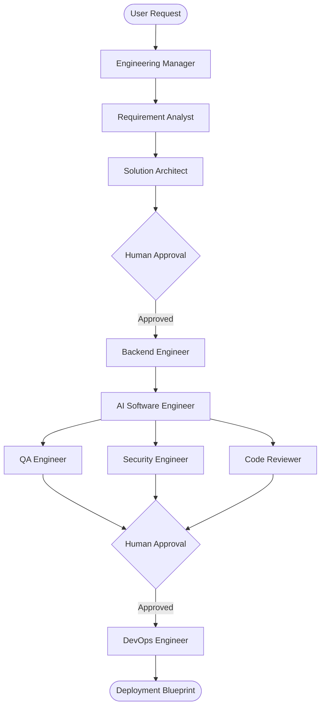

# ForgeAI

ForgeAI is a production-grade, multi-agent AI Software Engineering platform orchestrating specialized autonomous agents that collaborate to transform a software idea into production-ready artifacts. Powered by LangGraph, LangChain, and Google Gemini, ForgeAI operates as a virtual software engineering department.

---

## 🏗️ Architecture Overview

ForgeAI employs a state-gated hierarchical multi-agent workflow where specialized agents handle specific phases of the software development lifecycle (SDLC). The orchestrator routes the execution flow through specialized tasks, incorporating human-in-the-loop approvals at critical alignment milestones.

### System Workflow



---

## 🤖 Agent Roles & Packages

Every agent is modularized into its own self-contained python package under `agents/` to adhere to the Single Responsibility Principle:

1. **Engineering Manager (`agents/engineering_manager/`)**
   - High-level orchestrator. Schedules, delegates, and oversees execution across the agents.
2. **Requirement Analyst (`agents/requirement_analyst/`)**
   - Refines user input into complete functional requirements and user stories.
3. **Solution Architect (`agents/solution_architect/`)**
   - Designs software schemas, architectures, data flows, and system patterns.
4. **Backend Engineer (`agents/backend_engineer/`)**
   - Designs database schemas, API specs, and service contracts.
5. **AI Software Engineer (`agents/ai_software_engineer/`)**
   - Implements source code files matching requirements and architectural plans.
6. **QA Engineer (`agents/qa_engineer/`)**
   - Designs unit/integration test suites and validates functionality.
7. **Security Engineer (`agents/security_engineer/`)**
   - Audits code against security vulnerabilities (OWASP, injection, logic bypasses).
8. **Code Reviewer (`agents/code_reviewer/`)**
   - Analyzes style, modularity, and best practices. Provides critical PR reviews.
9. **DevOps Engineer (`agents/devops_engineer/`)**
   - Generates deployment blueprints, Dockerfiles, and CI/CD pipelines.

---

## 📂 Project Structure

```
forge-ai-langgraph/
├── api/                   # FastAPI route endpoints
│   ├── __init__.py
│   └── routes.py
├── app/                   # Graph execution core & state definitions
│   ├── __init__.py
│   ├── graph.py           # LangGraph StateGraph definitions
│   ├── router.py          # Node routing mechanics
│   ├── settings.py        # Configuration management
│   ├── state.py           # State schema structures
│   └── workflow.py        # Workflow nodes and handlers
├── agents/                # Specialist agent modules
│   ├── __init__.py
│   └── [agent_name]/
│       ├── __init__.py
│       ├── agent.py       # Specialist LLM agent loop
│       ├── prompt.md      # System prompt template
│       └── examples.md    # Few-shot examples
├── core/                  # Core helpers and shared libraries
│   ├── __init__.py
│   ├── llm.py             # LLM configurations (Gemini client wrapper)
│   ├── prompts.py         # Prompt loading & rendering utils
│   ├── artifact_manager.py# Disk/object storage manager for outputs
│   ├── versioning.py      # Output artifact versioning logic
│   ├── approval.py        # Human-in-the-loop approval gate utilities
│   ├── utils.py           # Helpers & utility logic
│   └── constants.py       # Global constants
├── memory/                # Long & short-term memory layer
│   ├── __init__.py
│   └── store.py           # Persistent checkpoint & memory layers
├── mcp/                   # Model Context Protocol integration
│   └── __init__.py
├── schemas/               # API input/output validation models
│   └── __init__.py
├── models/                # DB relational schemas
│   └── __init__.py
├── config/                # System settings config (Logging, etc.)
│   ├── __init__.py
│   └── logging.py
├── artifacts/             # Outputs generated during graph execution
│   ├── requirements/      # Requirements outputs
│   ├── architecture/      # Architectural specs
│   ├── backend/           # API specs and database designs
│   ├── implementation/    # Output source code
│   ├── qa/                # QA test scripts and reports
│   ├── security/          # Security review outputs
│   ├── review/            # Code review summaries
│   └── deployment/        # Kubernetes / Docker compose files
├── docs/                  # Project-wide developer documentation
├── tests/                 # Package test suites
├── .env.example           # Environment template file
├── .gitignore             # Git ignore targets
├── main.py                # Launch entry point
└── requirements.txt       # Dependencies
```

---

## 🛠️ Technology Stack

- **Language:** Python 3.12+
- **Orchestration:** LangGraph (StateGraph, nodes, edges, conditional routing)
- **Framework:** LangChain (LLM wrappers, document loading, message handling)
- **Base LLM:** Google Gemini Models
- **API Server:** FastAPI & Uvicorn
- **Validation:** Pydantic v2
- **Persistent Storage (Future):** Redis & PostgreSQL
- **Deployment Platform (Future):** Docker & Kubernetes

---

## 🚀 Roadmap & Future Capabilities

- [ ] **Human-in-the-Loop Gating:** Implement robust blocking UI and API prompts for manual manager review steps.
- [ ] **Parallel Agent Execution:** Execute QA, Security, and Code Reviewers in parallel utilizing LangGraph's native fan-out/fan-in.
- [ ] **Artifact Versioning:** Enable semantic diffs and rollback capabilities for generated artifacts.
- [ ] **Model Context Protocol (MCP):** Connect agents to external development environments, consoles, and search tools.
- [ ] **GitHub App Integration:** Auto-commit generated code directly to target branches and trigger pull requests.
- [ ] **Observability & Logging:** Trace agent chains using LangSmith and log output tokens.

---

## 📝 License

Distributed under the MIT License. See [LICENSE](LICENSE) placeholder for details.
