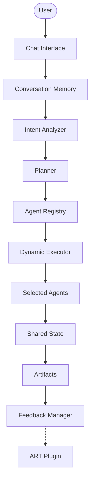

# ForgeAI

ForgeAI is an extensible Agentic AI Software Engineering Platform that dynamically analyzes user requests, plans execution, selects appropriate AI agents, and generates software engineering artifacts through a plugin-based architecture.

## Core Features

- **Dynamic Agent Platform:** Eliminates rigid, hardcoded pipelines in favor of a dynamic execution framework tailored to the specific user request.
- **Intent Analyzer:** Parses incoming prompts to accurately classify the core engineering objective before any heavy processing begins.
- **Planner Agent:** Synthesizes the intent classification into an optimized sequence of distinct execution steps.
- **Agent Registry:** A robust, plugin-based registry where autonomous agents broadcast their capabilities and register themselves upon initialization.
- **Dynamic Workflow Execution:** Constructs, compiles, and executes a temporary `LangGraph` topology perfectly matching the Planner's output on the fly.
- **Shared State Management:** Leverages strongly typed reducers to merge and share context natively across all dynamically mapped agents.
- **Conversation Memory:** Safely persists user lifecycles, execution histories, and artifact revisions.
- **Human Approval Workflow:** Integrated checkpoints designed to block execution until manual user validation is acquired for critical boundaries.
- **Plugin Architecture:** Strictly adheres to Open/Closed principles, allowing infinite horizontal scaling of capabilities.
- **UML Generation Pipeline:** A specialized visualization track that turns textual schema specifications into comprehensive architectural diagrams.
- **Syntax Validation:** Actively evaluates generated code and UML artifacts against strict syntactic rules, automatically requesting retries upon failure.
- **Feedback Collection:** Standardized pipelines for intercepting and logging manual human corrections on generated artifacts.
- **Future ART Plugin Integration:** Architectural hook ready for Reinforcement Learning from Human Feedback (RLHF) and Active Reasoning Tuning.

## Architecture Overview



### Architecture Components

- **User**: The developer or product manager initiating a software engineering request.
- **Chat Interface**: The primary entry point for prompts, follow-ups, and interactive feedback.
- **Conversation Memory**: The persistence layer that manages user identities, isolated sessions, and historical interactions to maintain stateful context.
- **Intent Analyzer**: Evaluates the unstructured input to definitively classify what the user is trying to accomplish (e.g., architecture design vs. code review).
- **Planner**: Maps the parsed intent against the capabilities of available agents to generate an ordered execution plan.
- **Agent Registry**: The centralized catalog of all available AI agents and their specific functional capabilities.
- **Dynamic Executor**: Takes the execution plan and compiles a custom `LangGraph` state machine explicitly designed for this specific request.
- **Selected Agents**: The subset of specialized agents (e.g., Solution Architect, Backend Engineer) spun up to perform the work.
- **Shared State**: The unified, immutable data structure that tracks reasoning logs, intermediate outputs, and file modifications across the executed agents.
- **Artifacts**: The tangible software outputs produced (e.g., source code, API specifications, Dockerfiles, UML diagrams).
- **Feedback Manager**: The collector that intercepts human reviews and corrections on the final artifacts.
- **ART Plugin**: The future integration point designed to ingest feedback and fine-tune model alignment over time.

## Workflow

The execution lifecycle of ForgeAI seamlessly transitions from unstructured thought to validated artifact:

**User Prompt** 
↓
**Intent Analysis** (Classifies the structural requirement) 
↓
**Execution Planning** (Constructs the ordered execution graph)
↓
**Capability Matching** (Identifies which agents satisfy the plan)
↓
**Dynamic Agent Selection** (Fetches the targeted agents from the Registry)
↓
**Execution** (Runs the dynamically compiled LangGraph natively)
↓
**Artifact Generation** (Saves source files and specs to disk)
↓
**Feedback Collection** (Interactively logs user adjustments)

## Agent Registry

The **Agent Registry** is the foundation of ForgeAI's plugin ecosystem:

- **BaseAgent**: Every specialist inherits from this abstract base class, guaranteeing a uniform `run(state)` execution signature.
- **Dynamic Discovery**: Agents are loaded and registered dynamically, allowing the platform to seamlessly scale.
- **Plugin Architecture**: External developers can inject entirely new agents simply by placing them in the appropriate directory.
- **Capability Matching**: Each agent exposes a static list of capabilities (e.g., `["security_audit", "code_review"]`). The orchestrator queries these tags to route workloads.
- **Open Closed Principle**: The core `app/dynamic_graph.py` orchestrator never requires modification. You can add 100 new agents without touching a single line of orchestration code.

## Supported User Flows

1. **New User**: The system detects an unrecognized identity, mints a new UUID profile, sets up an isolated workspace, and initializes a clean `Session`.
2. **Existing User**: The `ConversationMemoryManager` re-hydrates historical context, ensuring the LLM recalls prior architectural decisions and project constraints.
3. **Updated Prompt**: When follow-up instructions are provided, a new `ConversationTurn` is appended. The Intent Analyzer can bypass initial generation steps and jump straight to specialized refactoring agents.
4. **User Feedback**: Criticisms on specific artifacts are routed through the `FeedbackManager`, structured, and preserved to correct immediate state and train future runs.

## UML Generation Pipeline

ForgeAI features a highly sophisticated UML Generation Pipeline dedicated to software visualization.

**Supported Diagrams:**
- Sequence
- Component
- Class
- Activity
- Deployment
- Package

**Generation Lifecycle:**

**Prompt** (Defines the visual requirement)
↓
**Planner** (Routes the intent to the UML suite)
↓
**UML Generator** (Translates architectural context into raw diagram text)
↓
**PlantUML** (The standard textual language utilized for generation)
↓
**Syntax Validator** (An LLM gatekeeper that actively tests the PlantUML for missing brackets, invalid aliases, and structural errors)
↓
**Renderer** (Converts the validated text into visual outputs)

## Software Design

ForgeAI heavily leverages enterprise-grade software design principles:

- **SOLID Principles:** Strict adherence across all modules (e.g., Single Responsibility per agent; Interface Segregation via `ARTPluginInterface`).
- **Separation of Concerns:** Distinct boundaries between data shapes (`memory/models.py`), storage mechanics (`memory/storage.py`), and orchestration execution (`app/dynamic_graph.py`).
- **Plugin Architecture:** The entire agent execution layer is abstracted, treating individual AI models as hot-swappable plugins.
- **Dependency Injection:** Storage engines and interfaces are injected into Managers dynamically, allowing seamless transitions to vector databases or cloud storage.
- **Backward Compatibility:** The original static LangGraph in `app/graph.py` remains 100% operational alongside the newly implemented dynamic orchestrator.
- **Extensibility:** Unrestricted capability to add new logic branches via the dynamic Planner.

## Tech Stack

- **Python** 
- **LangGraph** 
- **LangChain** 
- **FastAPI** 
- **Pydantic** 
- **Rich** 
- **PlantUML** 
- **Mermaid** 
- **OpenAI** 
- **Gemini** 
- **OpenRouter** 

## Folder Structure

```
forge-ai-langgraph/
├── api/                   
├── app/                   
│   ├── dynamic_graph.py   
│   ├── graph.py           
│   ├── router.py          
│   ├── settings.py        
│   ├── state.py           
│   └── workflow.py        
├── agents/                
│   ├── ai_software_engineer/
│   ├── backend_engineer/  
│   ├── base.py            
│   ├── code_reviewer/     
│   ├── devops_engineer/   
│   ├── engineering_manager/
│   ├── intent_analyzer/   
│   ├── planner/           
│   ├── qa_engineer/       
│   ├── requirement_analyst/
│   ├── security_engineer/ 
│   ├── solution_architect/
│   ├── uml_generator/     
│   └── uml_validator/     
├── artifacts/             
├── config/                
├── core/                  
│   ├── feedback/          
│   │   ├── art_plugin.py  
│   │   ├── manager.py     
│   │   ├── models.py      
│   │   └── storage.py     
│   ├── agent_registry.py  
│   ├── approval.py        
│   ├── artifact_manager.py
│   ├── constants.py       
│   ├── dynamic_executor.py
│   ├── llm.py             
│   ├── prompts.py         
│   ├── report_generator.py
│   ├── utils.py           
│   ├── versioning.py      
│   └── workflow_events.py 
├── docs/                  
├── examples/              
├── mcp/                   
├── memory/                
│   ├── manager.py         
│   ├── models.py          
│   ├── storage.py         
│   └── store.py           
├── models/                
├── schemas/               
├── tests/                 
├── .env                   
├── .env.example           
├── .gitignore             
├── main.py                
├── pyrightconfig.json     
└── requirements.txt       
```

## Future Roadmap

- **Parallel Agent Execution:** Execute disparate workflows simultaneously utilizing LangGraph's native fan-out capabilities.
- **MCP Integration:** Bind agents directly to local IDE tooling via the Model Context Protocol.
- **Multi-LLM Routing:** Send basic tasks to rapid models, and complex architecture tasks to heavy reasoning models seamlessly.
- **Vector Memory:** Transition from JSON metadata to high-dimensional semantic search.
- **Tool Registry:** Introduce a centralized marketplace of tools that agents can dynamically discover and equip.
- **RAG:** Retrieval-Augmented Generation over existing enterprise codebases.
- **Distributed Execution:** Detach execution from the local thread via queue-based orchestration.
- **RLHF:** Reinforcement Learning from Human Feedback.
- **ART Plugin:** Active Reasoning Tuning to align outputs organically.

## Example Workflow

**User Request:**
```json
{
  "prompt": "I am working on a compliance monitoring solution which will pull in the latest circulars from SEBI and parse them. Once it is parsed into a table to clauses, you will need to extract the compliance requirements, perform gap analysis and identify operational impact.",
  "diagram_types": [
    "sequence",
    "component"
  ]
}
```

**ForgeAI Execution Pipeline:**

1. **Intent Analysis**: The `IntentAnalyzerAgent` parses the prompt and categorizes the request strictly under `architecture_design` and `uml_generation`.
2. **Execution Planning**: The `PlannerAgent` reads these intents, scans the `AgentRegistry`, and synthetically builds an execution plan: `["Solution Architect", "UML Generator", "UML Validator"]`.
3. **Dynamic Orchestration**: The `DynamicWorkflowOrchestrator` generates a temporary LangGraph binding these three specific nodes sequentially.
4. **Architectural Design**: The `Solution Architect` triggers, defining the system topology for SEBI circular parsing and gap analysis.
5. **UML Generation**: The `UML Generator` translates this complex topology into strict PlantUML syntax, mapping out the Sequence and Component diagrams requested.
6. **Syntax Validation**: The `UML Validator` actively tests the generated text. If any PlantUML parsing errors or unclosed brackets are found, it triggers a retry loop natively within the graph, ensuring perfect outputs.
7. **Artifact Storage & Memory**: The final `.puml` files are written to disk, and the full conceptual context is saved to `Conversation Memory` for the user's next iterative prompt.
