# Component Diagram Knowledge Base

This document contains canonical PlantUML component diagram examples to demonstrate correct syntax, structure, and best practices.

## 1. Basic Component and Actor

**GOOD:**
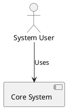

**BAD:**
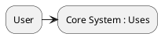
**Reason why BAD is incorrect:** Actors and components must be explicitly declared before use, especially when they contain spaces. Arrow syntax `->` is typical for sequence diagrams; component diagrams generally use `-->`.

## 2. Databases and Stereotypes

**GOOD:**
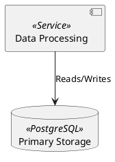

**BAD:**
```plantuml
@startuml
component Processor <<Service>>
database Primary Storage <<PostgreSQL>>
Processor --> Primary Storage : Reads/Writes
@enduml
```
**Reason why BAD is incorrect:** Strings with spaces like "Primary Storage" must be enclosed in quotes when defining the element. 

## 3. Packages for Grouping

**GOOD:**
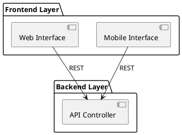

**BAD:**
```plantuml
@startuml
group Frontend Layer {
    component Web
}
@enduml
```
**Reason why BAD is incorrect:** `group` is a keyword used in sequence diagrams. In component diagrams, `package`, `node`, `folder`, or `cloud` must be used for grouping elements.

## 4. Interfaces and Provided/Required Ports

**GOOD:**
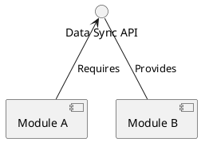

**BAD:**
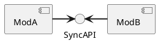
**Reason why BAD is incorrect:** `=>` and `<=` are not valid directional arrows for linking components and interfaces in PlantUML component diagrams. Use standard dashed lines (`..>`), solid lines (`-->`), or directional lines (`-up->`, `-down->`).

## 5. Cloud and External Systems

**GOOD:**
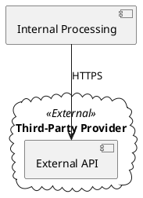

**BAD:**
```plantuml
@startuml
component Internal
External API <<External>>
Internal -> External API : HTTPS
@enduml
```
**Reason why BAD is incorrect:** "External API" is used without a declaration, contains a space without quotes, and `cloud` grouping is missing. Stereotypes (`<<External>>`) must be placed at the declaration.

## 6. Labeled Arrows and Direction

**GOOD:**
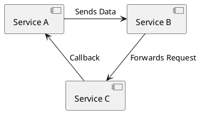

**BAD:**
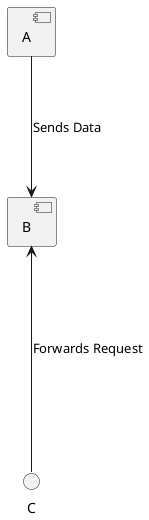
**Reason why BAD is incorrect:** Using multiple hyphens (`--->` or `<----`) is discouraged and can lead to unpredictable layouts or syntax errors. Use directional hints (`-right->`, `-down->`) if layout control is needed.

## 7. Nested Components

**GOOD:**
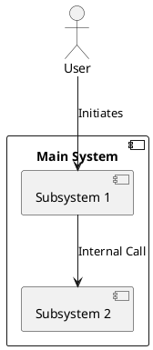

**BAD:**
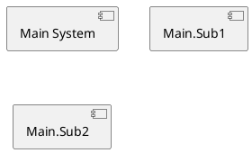
**Reason why BAD is incorrect:** Dot notation (`Main.Sub1`) is not valid for nesting components. You must declare the outer component using braces `{}` and place the inner components inside.

## 8. Explicit Ports

**GOOD:**
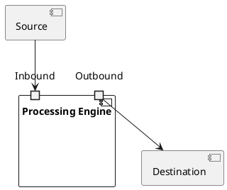

**BAD:**
```plantuml
@startuml
component Engine
port Inbound
port Outbound
Engine -> Inbound
Engine -> Outbound
@enduml
```
**Reason why BAD is incorrect:** Ports must be declared inside the component definition block using `{}`. Floating ports disconnected from a component body violate PlantUML semantics.
