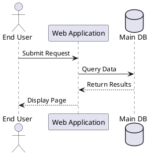
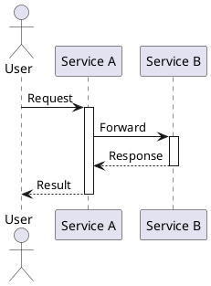
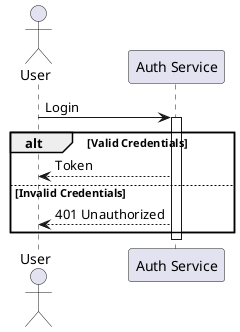
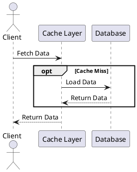
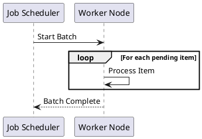
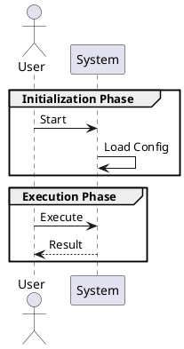
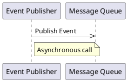

# Sequence Diagram Knowledge Base

This document contains canonical PlantUML sequence diagram examples to demonstrate correct syntax, structure, and best practices.

## 1. Basic Actors and Participants

**GOOD:**


**BAD:**
```plantuml
@startuml
End User -> Web Application : Submit Request
Web Application -> Main DB : Query Data
@enduml
```
**Reason why BAD is incorrect:** Names with spaces must be explicitly declared as participants/actors before they are used, or must be surrounded by quotes during every invocation (which is harder to maintain).

## 2. Activation and Deactivation

**GOOD:**


**BAD:**
```plantuml
@startuml
actor User
participant A
participant B

User -> A : Request
A.activate()
A -> B : Forward
B.activate()
B --> A : Response
B.deactivate()
@enduml
```
**Reason why BAD is incorrect:** PlantUML uses the `activate <participant>` and `deactivate <participant>` keywords on their own lines, not method-like syntax `A.activate()`.

## 3. Alternative Paths (alt / else)

**GOOD:**


**BAD:**
```plantuml
@startuml
actor User
participant Auth

User -> Auth : Login
if Valid Credentials
    Auth --> User : Token
else
    Auth --> User : 401
endif
@enduml
```
**Reason why BAD is incorrect:** Sequence diagrams in PlantUML use the `alt` / `else` / `end` keywords to represent branching logic, not `if` / `endif`.

## 4. Optional Execution (opt)

**GOOD:**


**BAD:**
```plantuml
@startuml
actor Client
participant Cache

Client -> Cache : Fetch Data
optional Cache Miss
    Cache -> DB : Load Data
end optional
@enduml
```
**Reason why BAD is incorrect:** The keyword is exactly `opt`, closed by `end`. `optional` and `end optional` are invalid syntax in PlantUML sequence diagrams.

## 5. Loops (loop)

**GOOD:**


**BAD:**
```plantuml
@startuml
participant Cron
participant Worker

Cron -> Worker : Start Batch
for each pending item
    Worker -> Worker : Process Item
end for
@enduml
```
**Reason why BAD is incorrect:** The correct keyword for iteration in a sequence diagram is `loop`, closed by `end`. `for` and `end for` are incorrect syntax.

## 6. Logical Grouping (group)

**GOOD:**


**BAD:**
```plantuml
@startuml
actor User
participant Sys

phase Initialization Phase {
    User -> Sys : Start
}
@enduml
```
**Reason why BAD is incorrect:** PlantUML uses `group <Label>` followed by `end` to draw a frame around a set of messages. Curly braces `{}` and non-standard keywords like `phase` are invalid for grouping in sequence diagrams.

## 7. Stereotypes and External Systems

**GOOD:**
```plantuml
@startuml
participant "Internal Logic" as Internal
boundary "External API" <<External>> as ExtAPI

Internal -> ExtAPI : Send Payload
ExtAPI --> Internal : Ack
@enduml
```

**BAD:**
```plantuml
@startuml
participant Internal
participant External API <<External>>

Internal -> External API <<External>> : Send Payload
@enduml
```
**Reason why BAD is incorrect:** The stereotype `<<External>>` should be applied when the participant is declared using the `as` alias syntax, and should not be appended during message invocation.

## 8. Asynchronous Messages

**GOOD:**


**BAD:**
```plantuml
@startuml
participant Pub
participant MQ

Pub ~> MQ : Publish Event
@enduml
```
**Reason why BAD is incorrect:** The standard syntax for an asynchronous message in PlantUML sequence diagrams is `->>`. `~>` is generally not used for asynchronous calls in sequence diagrams.
