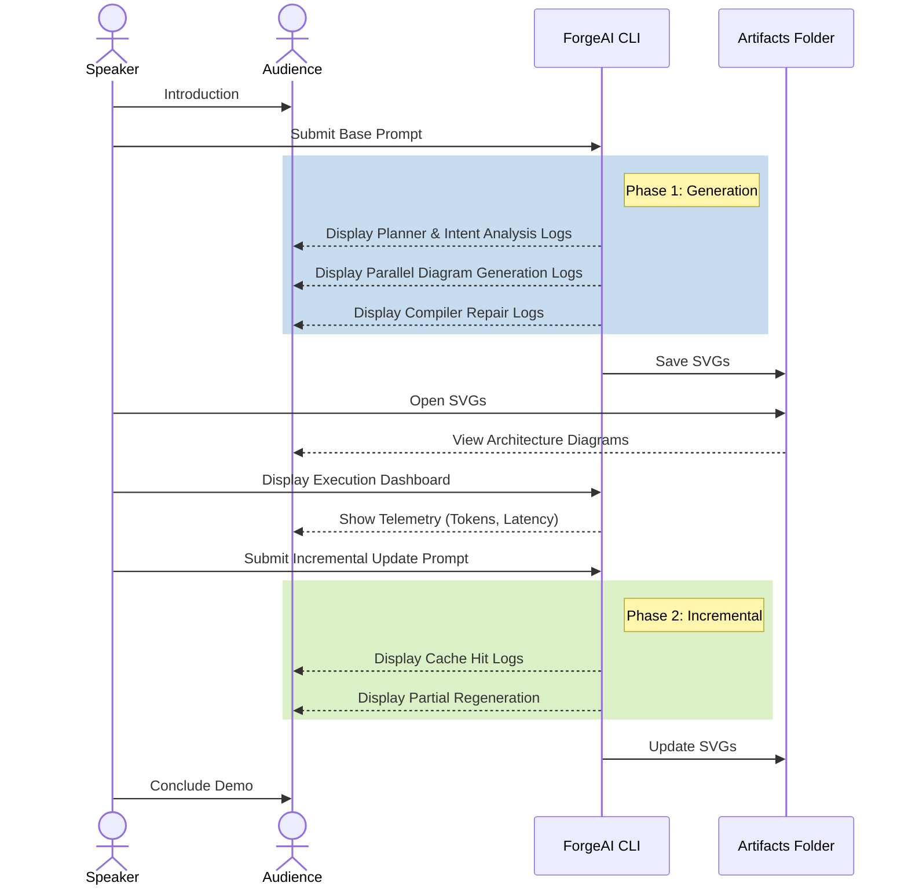

# ForgeAI Demonstration Flow

```mermaid
sequenceDiagram
    actor Speaker
    actor Audience
    participant CLI as ForgeAI CLI
    participant Folder as Artifacts Folder

    Speaker->>Audience: Introduction
    Speaker->>CLI: Submit Base Prompt
    
    rect rgb(200, 220, 240)
        Note right of CLI: Phase 1: Generation
        CLI-->>Audience: Display Planner & Intent Analysis Logs
        CLI-->>Audience: Display Parallel Diagram Generation Logs
        CLI-->>Audience: Display Compiler Repair Logs
    end
    
    CLI->>Folder: Save SVGs
    Speaker->>Folder: Open SVGs
    Folder-->>Audience: View Architecture Diagrams
    
    Speaker->>CLI: Display Execution Dashboard
    CLI-->>Audience: Show Telemetry (Tokens, Latency)
    
    Speaker->>CLI: Submit Incremental Update Prompt
    
    rect rgb(220, 240, 200)
        Note right of CLI: Phase 2: Incremental
        CLI-->>Audience: Display Cache Hit Logs
        CLI-->>Audience: Display Partial Regeneration
    end
    
    CLI->>Folder: Update SVGs
    Speaker->>Audience: Conclude Demo
```
