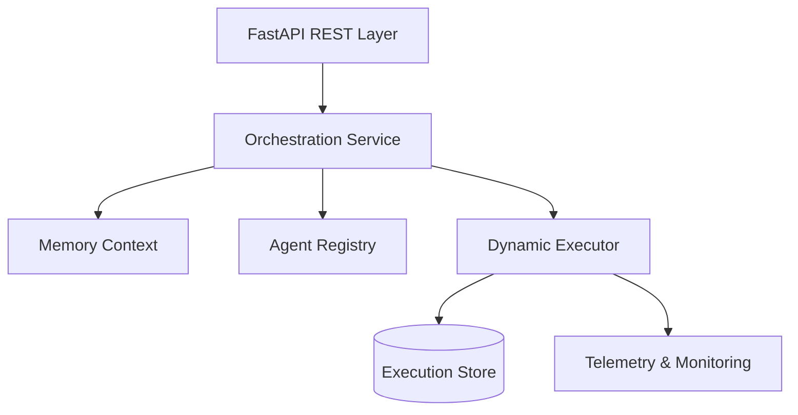
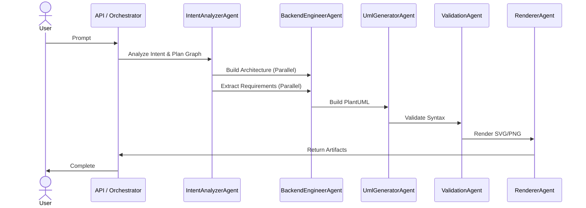
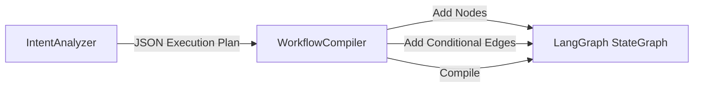
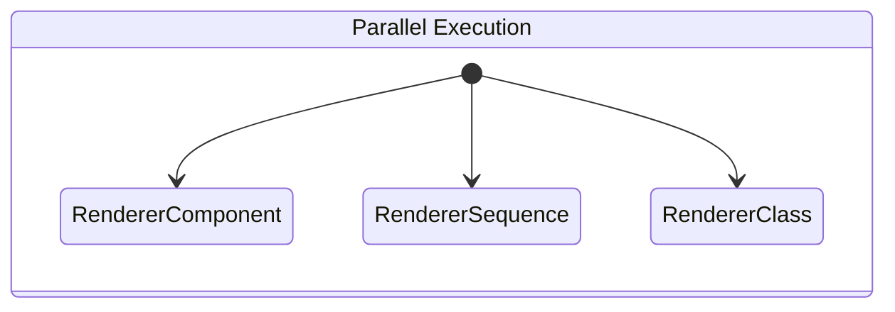
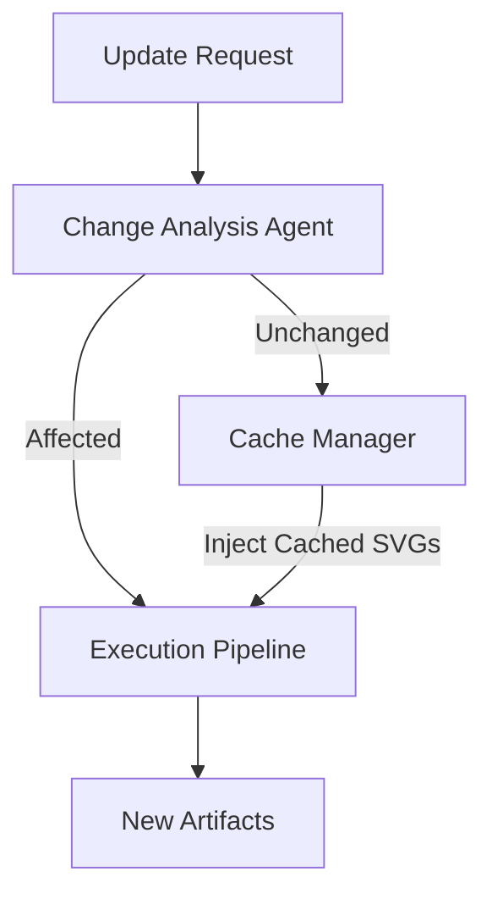
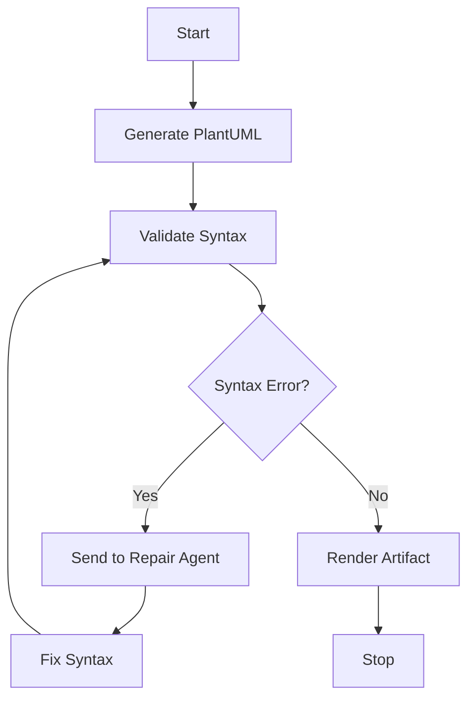
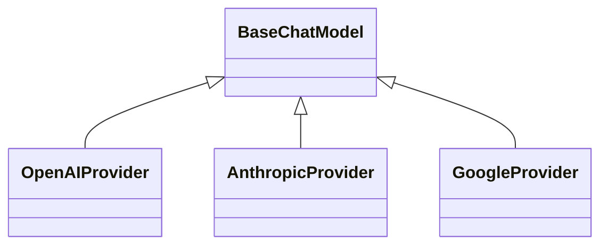
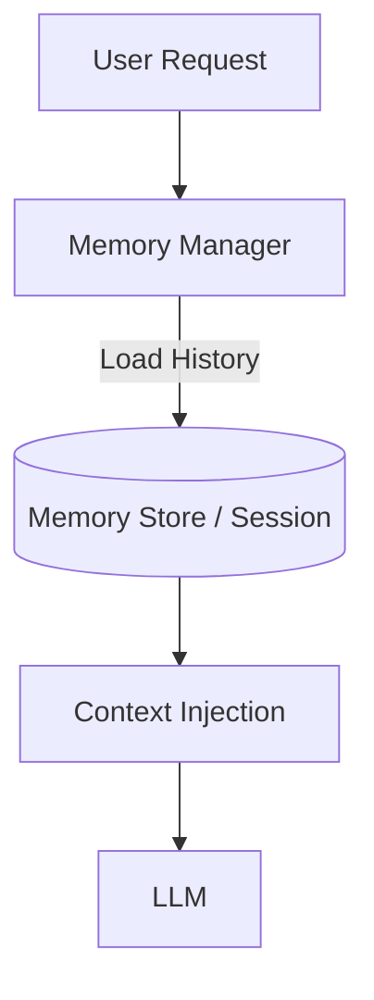
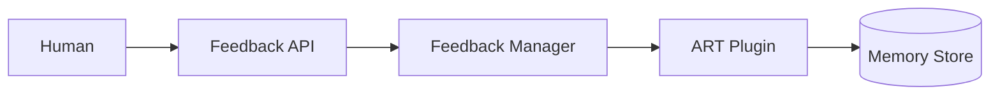
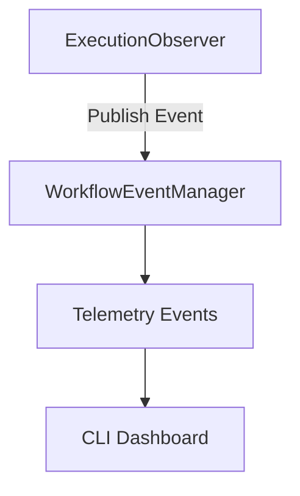

# ForgeAI Architecture Diagrams

## 01 High Level Architecture

## 02 Agent Interaction

## 03 Dynamic Langgraph Compilation

## 04 Parallel Execution Pipeline

## 05 Incremental Regeneration

## 06 Uml Repair Pipeline

## 07 Provider Abstraction

## 08 Conversation Memory

## 09 Feedback Art Pipeline

## 10 Execution Dashboard

